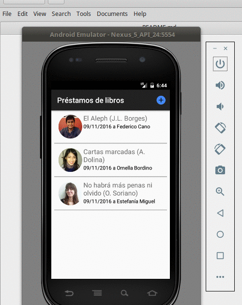

# Préstamos de libros en Android

 

Es una aplicación bastante completa, desarrollada para la SDK 24 (Android 7)

* utiliza la API de Contactos propia de Android
* permite ver cómo trabajar imágenes
* también cómo crear intents para enviar mail o llamar por teléfono, lo que requiere configurar permisos programáticamente
* se puede configurar para trabajar con un esquema en memoria o persistente contra [SQL Lite](https://sqlite.org/). Ver para ello [PrestamosConfig](app/src/main/java/ar/edu/uqbar/prestamos/config/PrestamosConfig.java)

## Enunciado

Queremos saber los préstamos pendientes de los libros que le prestamos a nuestros amigos, para

* enviarle un mail pidiendo que lo devuelva
* llamarlo y hacer el pedido nosotros
* o bien indicar que nuestro contacto lo devolvió.

También podemos generar nuevos préstamos, buscando los contactos de nuestro dispositivo y una serie de libros que por el momento están hardcodeados.
Se integra a futuro con la aplicación de libros que está aparte.

## El proyecto
Este proyecto está generado para

* Android Studio 2.2 (Septiembre 2016)
* con Gradle 2.14.1 (el que viene con Android Studio)
* para una SDK 24 (Nougat)

## La arquitectura

* Tenemos un componente encargado del **origen de datos**, con elementos que persisten a SQLite (SQLLiteRepoPrestamos y SQLLiteRepoLibros) y elementos que trabajan en memoria (CollectionBasedPrestamos y CollectionBasedLibros)
* En el mismo package se ubica un componente que se encarga de consumir los servicios de la API de Contactos de Android (PhoneBasedContactos), que funciona como **adapter** contra un objeto de dominio que representa un Contacto
* **El modelo**: lo conforma un Préstamo que tiene asociado un Contacto y un Libro. Un préstamo sabe validarse, prestarse y devolverse.
* También se distinguen excepciones de negocio y de programa.
* **Las vistas**: son dos: la principal (MainActivity) muestra los préstamos pendientes en un ListView específico y la segunda es la pantalla que permite dar de alta un préstamo (NuevoPrestamoActivity). Cada uno tiene su correspondiente **controller**.
* Además hay una clase PrestamosAppBootstrap que inicializa la aplicación con datos ficticios. 

**IMPORTANTE:** en el caso en que lo corran en sus celulares les generará 5 contactos ficticios, por lo que conviene correrlo en un emulador siempre que disponga de una máquina lo suficientemente potente.

No tenemos binding, así que el controller debe manualmente convertir los valores de la vista hacia el controller y viceversa, lo que incluye el manejo de errores.

## Links con explicaciones adicionales

* [Pantalla principal: lista de préstamos](http://algo3.uqbar-project.org/temario/05-mobile/lista-de-prestamos)
* [Mejorando el layout de la lista de préstamos](http://algo3.uqbar-project.org/temario/05-mobile/mejorando-el-layout-de-la-lista-de-prstamos)
* [Intents. Contactar un deudor](http://algo3.uqbar-project.org/temario/05-mobile/contactar)
* [Interacción con API ContentProvider para crear o visualizar contactos](http://algo3.uqbar-project.org/temario/05-mobile/interaccion-con-api-contactos)
* [Persistencia a un medio local con SQLite](http://algo3.uqbar-project.org/temario/05-mobile/persistencia-a-un-medio-local)
* [Crear un nuevo préstamo](http://algo3.uqbar-project.org/temario/05-mobile/crear-nuevo-prestamo)

